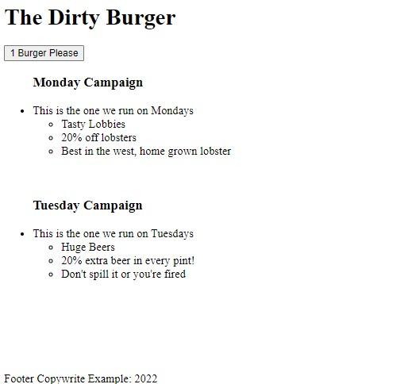

# Me Learning React

My first tries at a react app, it didn't go too bad. 

I followed a tutorial then added a few embelishments of my own as I figured things out.

I've kept this as a reference for myself, not because it is outstandingly useful on it's own.

Feel free to take a look and critique my efforts :D

## What Does It Render

Take a look, it's pretty basic.

It has a header, a body, and a footer.

The lists are rendered dynamically and will loop if there are more elements added to the object

